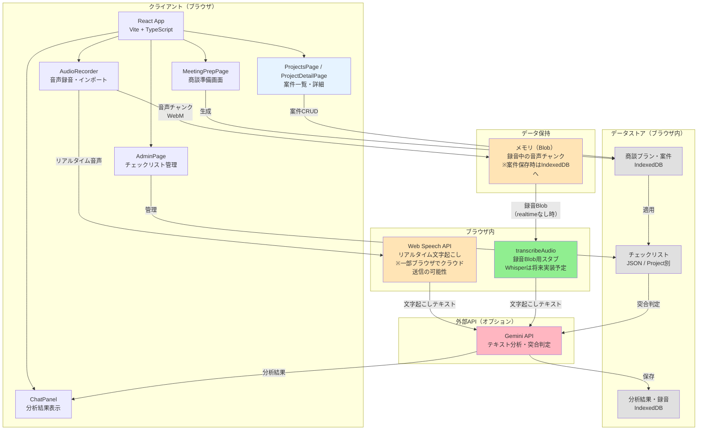
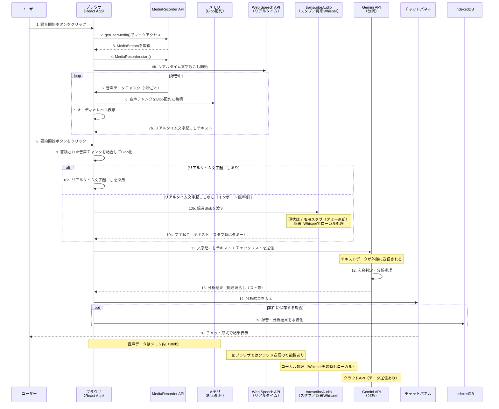
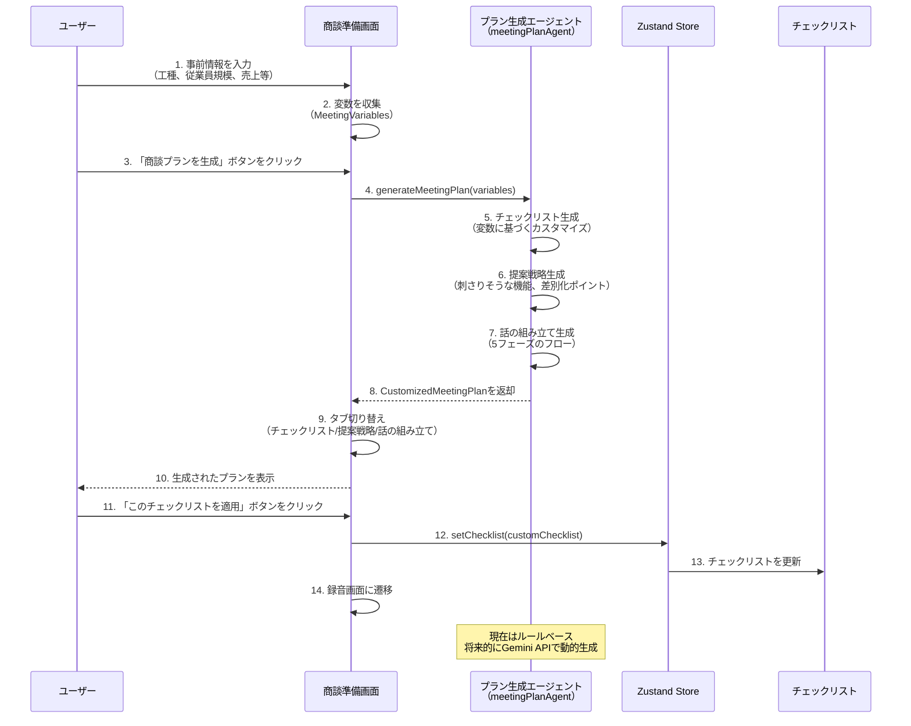
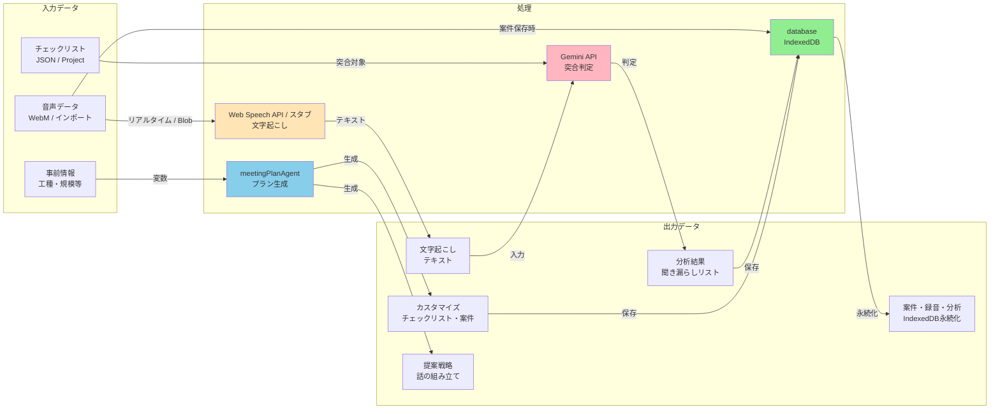
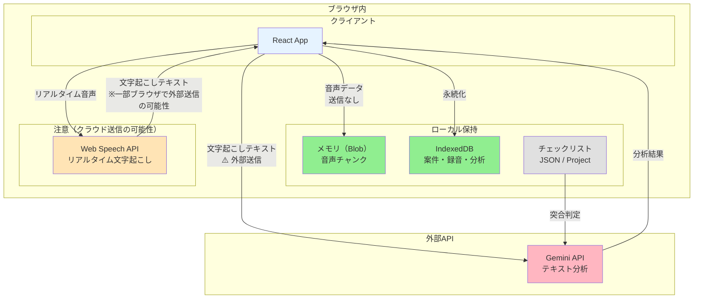
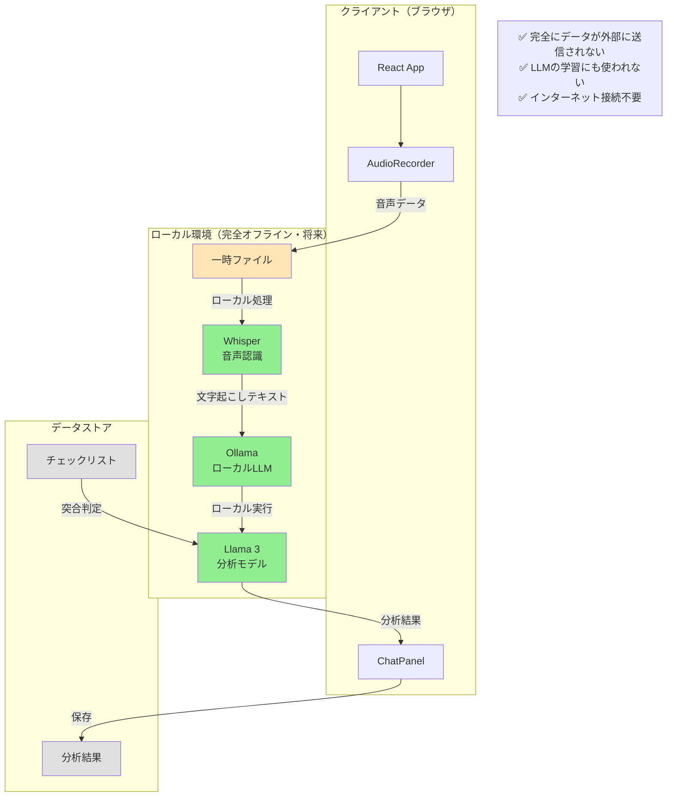
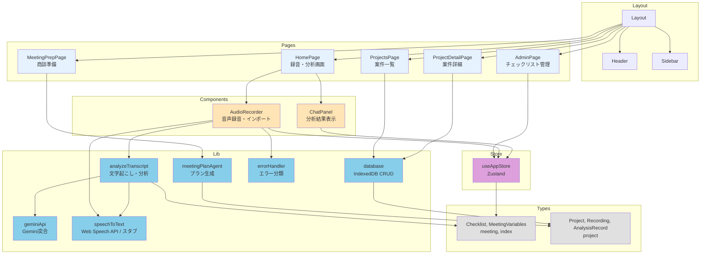
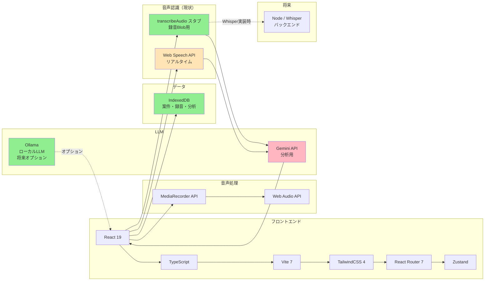
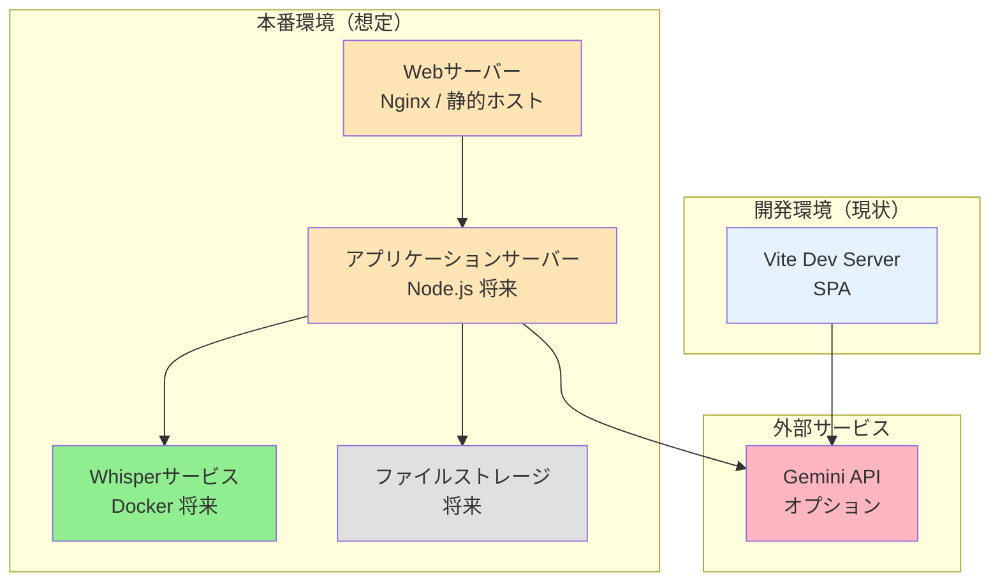
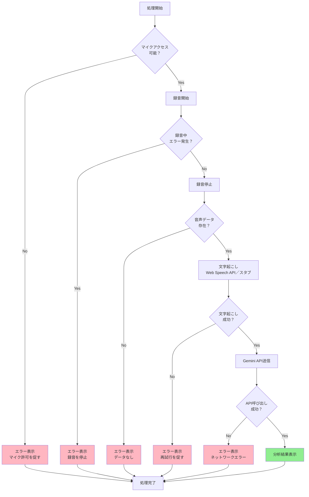

# システムアーキテクチャ

## 1. システム構成図

**凡例**:
- 🟢 緑: ローカル実行（スタブ／将来Whisper。データが外部に送信されない）
- 🟡 黄: 一時データ／注意（Web Speech APIは一部ブラウザでクラウド送信の可能性あり）
- 🔴 ピンク: 外部API（データ送信あり）

---

## 2. 音声録音→分析のシーケンス図

---

## 3. 商談準備フローのシーケンス図

---

## 4. データフロー図

---

## 5. セキュリティ境界図

**セキュリティ境界**:
- 🟢 **ブラウザ内**: 音声データ（Blob）、IndexedDBの案件・録音・分析はブラウザ内に保持
- 🟡 **注意**: Web Speech API はブラウザ実装により音声をクラウドに送信する場合あり（Chrome 等）
- 🔴 **外部送信**: 文字起こしテキストが Gemini API に送信される

---

## 6. 完全ローカル実行アーキテクチャ（将来オプション）

**注**: 現状は未実装。Whisper・Ollama を導入する際の参照用。

---

## 7. コンポーネント構成図

---

## 8. 技術スタック

---

## 9. デプロイメント構成

**現状**: Vite ビルドによる SPA。静的ホスティング（例: Nginx, Vercel, GitHub Pages）で配信。バックエンド・Whisper サーバーは未実装。データはブラウザの IndexedDB に保持。

**将来想定**:

---

## 10. エラーハンドリングフロー

---

## まとめ

### 主要な特徴

1. **ブラウザ内完結**: 音声はメモリ（Blob）で保持。案件・録音・分析は IndexedDB に永続化（バックエンド不要）
2. **モジュラー設計**: 各コンポーネントが独立。案件（Project）を軸に商談準備・録音・分析を一貫して管理
3. **セキュリティ境界**: 音声の保持場所、Web Speech API の扱い、Gemini API 送信を明確に区別
4. **拡張性**: Whisper（ローカル）・Ollama 等の将来実装を見据えた設計。Gemini 不可時はキーワードマッチでフォールバック

### セキュリティ考慮事項

- ✅ **音声データ**: メモリ（Blob）／IndexedDB。バックエンドや Whisper サーバーは現状なし（将来は Whisper でローカル処理を推奨）
- 🟡 **Web Speech API**: リアルタイム文字起こし。一部ブラウザ（Chrome 等）では音声をクラウドに送信する可能性あり
- ⚠️ **文字起こしテキスト**: Gemini API に送信（突合分析のため）
- 🔒 **完全ローカル実行**: Ollama + Llama 3（将来オプション）。Whisper 実装により音声もローカル処理可能
